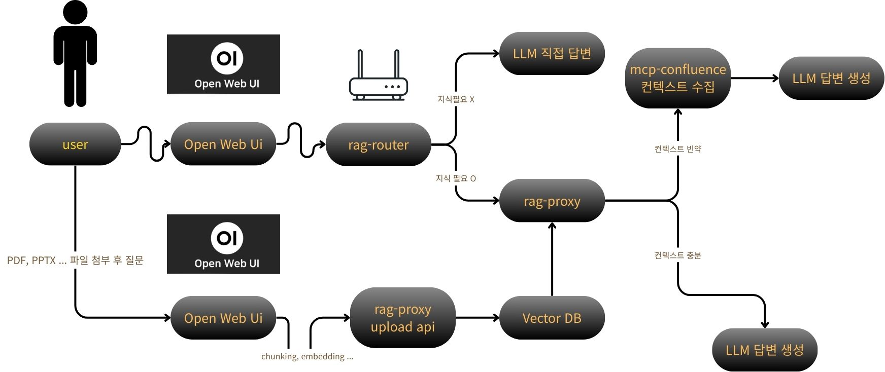
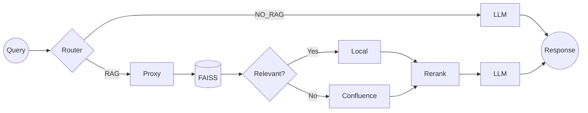

## Problem
We needed a faster way to search internal Confluence pages and uploaded files.

## Constraint
SSO/access control frequently blocked REST API calls; WebUI MCP integration was not sufficient.

## Solution
Implemented a RAG pipeline with a router/proxy separation and an SSO-safe Confluence fallback.

## Status
PoC verified on an on-prem GPU server; preparing for production hardening.

## Architecture

- open-webui: UI
- rag-router: LLM direct vs RAG route + masking/strict gate
- rag-proxy: FAISS retrieval + rerank + context build, fallback to mcp-confluence



## Runtime flow (current)
- OpenWebUI → **rag-router** (tri-state routing: NO_RAG / RAG / RAG_REQUIRED, history handling, rewrite)
- **rag-router → rag-proxy** (/qa or /query)
- **rag-proxy**: FAISS+bge-m3 dense retrieval + optional sparse candidates + rule-based rerank
- If context is insufficient (coverage/anchor_miss/etc.), **fallback to mcp-confluence** for additional context
- **rag-router** generates the final answer with strict context gating + masking (or LLM direct answer when NO_RAG)

## Quickstart

### Services (host ports)
- Open WebUI: `http://<server>:3000`
- rag-router (OpenAI-compatible): `http://<server>:8088`
- rag-proxy (RAG engine): `http://<server>:8080`
- mcp-confluence: internal-only (not exposed to host)

### Start
1) `cp .env.example .env`
2) `docker compose up -d`

### Health checks
```bash
curl -s http://<server>:8080/health
curl -s http://<server>:8088/v1/models
```
### Chat (via rag-router)
```bash
curl -s http://<server>:8088/v1/chat/completions \
  -H "Content-Type: application/json" \
  -d '{
    "model": "/model/Qwen2.5-14B-Instruct",
    "messages": [{"role":"user","content":"업로드한 문서 요약해줘"}],
    "stream": false
  }'
```
## Demo example
**Q:** "리눅스 도커 세미나 내용 자세히 요약해줘"  
**A (excerpt):**
- 근거: 로컬 문서(RAG)
- 세미나에서 리눅스 서버 운영 기본(터미널 기반 작업/자동화/권한 관리)을 다룸
- Cron 스케줄링 개념과 형식(분/시/일/월/요일) 및 `crontab -e` 사용법을 설명
- 예: 정해진 시각에 학습 스크립트 실행 및 로그 리다이렉션 방식 소개
- 민감 경로/계정 정보는 마스킹 처리됨
**Latency:** ~40s (measured via `time curl` on the on-prem host)

## Upload Support (RAG)
- PDF, DOCX, PPTX, XLSX, CSV, TXT, LOG, MD
- PPTX: slide text + table extraction + speaker notes; optional image OCR
- XLSX: header-aware row extraction with sheet metadata
- DOCX: paragraph + table extraction

## Optional Env
- `PPTX_OCR=1` to OCR images in slides (requires Tesseract)
- `XLSX_MAX_ROWS_PER_SHEET` (default: 2000)
- `XLSX_MAX_COLS` (default: 50)
- `ROUTER_INGEST_WAIT_SEC` (default: 8)
- `ROUTER_INGEST_WAIT_INTERVAL` (default: 1.0)
- `ROUTER_KO_MORPH=1` to enable Korean morphological tokenization (requires kiwipiepy)
- `ROUTER_UPLOADS_DIR` (default: /data/uploads)

### Runtime config (examples)
- LLM endpoint (OpenAI-compatible): `http://<LLM_HOST>:8015/v1`
- LLM model: `/model/Qwen2.5-14B-Instruct`
- Embedding model: `BAAI/bge-m3`
- Upload dir: `/app/uploads`
- FAISS index dir: `/app/faiss_index`
